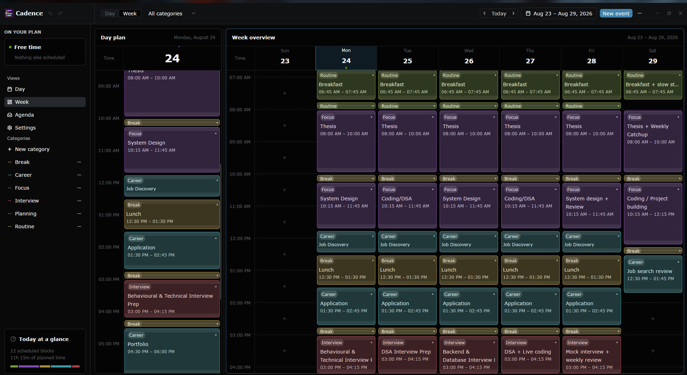
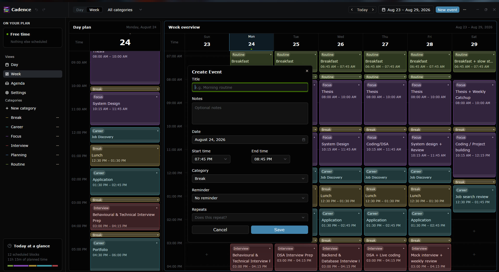
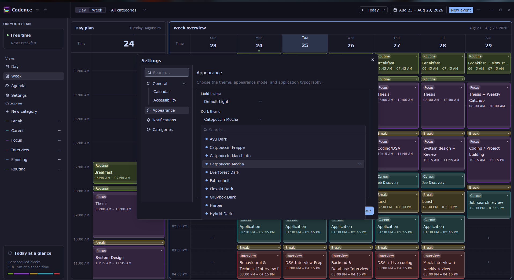

# Cadence

Cadence is a local-first desktop timetable for planning a day and understanding
a week. Built with Rust, [GPUI](https://gpui.rs/), and [GPUI
Component](https://longbridge.github.io/gpui-component/), it keeps the calendar
as a quiet, spatially honest time grid rather than a dashboard.

> **Project status:** Milestones M0–M11 are implemented. Cadence is release-ready
> for Ubuntu 26.04 LTS on x86_64 under Wayland; tagging a version creates a
> draft GitHub release for a final manual smoke test before publication.

## What it does

- Keep a seven-day Week viewport visible, scroll continuously through adjacent
  dates, and open any focused Day plan from its weekday header.
- Navigate by rolling date range, jump to today, and filter by category.
- Keep one event per time interval across every category, with a fixed time
  gutter, sticky day headers, current-time treatment, and horizontal or
  vertical scrolling where needed.
- Create events from the toolbar or an empty time slot; inspect, edit,
  duplicate, delete, move, and resize them; undo or redo committed changes
  during the current session.
- Select visible events in the active Day or Week surface and delete them in one
  confirmed, undoable operation; recurring selections affect only those dates.
- Validate event titles, categories, time ranges, and schedule conflicts before
  changing the timetable. Adjacent end/start boundaries remain valid.
- Use pointer and keyboard interactions with light and dark themes.
- Drag event bodies across time and days, resize their start or end, preview
  snapped changes, and cancel an in-progress manipulation with Escape.
- Schedule Daily, Weekdays, or Weekly routines; weekly routines default to the
  event date's weekday (for example, “Weekly on Monday”) and can be customized
  to multiple weekdays with an optional inclusive end date. Edit or delete one
  occurrence or this and all following occurrences without expanding the series
  into copied rows.
- Store events, categories, settings, and calendar preferences locally with
  transactional writes and numbered schema migrations, including recurring
  series and per-occurrence exceptions.
- Manage custom categories, use the agenda sheet to scan the current range,
  and follow a compact Now / Next summary in the sidebar.
- Category colours adapt to the active light or dark theme, including event
  surfaces, borders, indicators, filters, and summaries.
- Set per-event reminders and opt into desktop notifications while Cadence is
  running; notification actions open the exact event, and minimizing to the
  Linux tray keeps delivery active. Operating-system notification permissions
  still apply.
- Choose a light, dark, or system appearance mode, a bundled GPUI theme, and
  the application font family and size from separate Themes and Typography
  settings pages. Hover or focus an option to preview it globally; click or
  press Enter/Space to commit, and leave Settings to restore the committed
  appearance.
- Export a human-readable JSON backup or reveal the data folder from the
  toolbar.

## Screenshots

Cadence keeps the week overview, focused day plans, event editor, and appearance
preferences close at hand:



*Open a focused day plan from any Week header without losing the surrounding
weekly context.*



*The Create Event dialog supports titles, notes, dates, time ranges, categories,
reminders, and recurrence.*



*Themes and Typography are separate settings pages; hovering or focusing an
option previews the global appearance before it is committed.*

## Requirements

The supported release and development baseline is Ubuntu 26.04 LTS on x86_64,
running a Wayland session. Cadence currently enables only the Wayland backend;
X11 support has not been enabled or tested. The repository pins Rust 1.97.1 in
`rust-toolchain.toml` for builds and CI.

Install Rust with [rustup](https://rustup.rs/):

```sh
rustup toolchain install 1.97.1 --profile minimal
rustup component add --toolchain 1.97.1 clippy rustfmt
```

On Ubuntu or Debian, install the compiler toolchain and native libraries used by
the current GPUI Wayland build:

```sh
sudo apt update
sudo apt install \
  build-essential clang cmake git pkg-config \
  libfontconfig-dev libglib2.0-dev libssl-dev libvulkan1 \
  libwayland-dev libx11-xcb-dev libxkbcommon-x11-dev libzstd-dev
```

A working Vulkan driver and Wayland compositor are runtime requirements. The
GPUI dependency graph is locked in `Cargo.lock`; use Cargo's `--locked` flag for
reproducible builds and automated checks.

## Run

From the repository root:

```sh
cargo run --locked
```

Use `cargo run --locked -- --version` to inspect the compiled version, commit,
and GPUI revision without opening a window.

## Install a release

After a version tag has produced a draft or published GitHub release, download
the Ubuntu x86_64 `.deb` and install it with:

```sh
sudo apt install ./cadence_<version>_amd64.deb
```

The release target is Ubuntu 26.04 LTS on Wayland. See the [user guide](docs/USER_GUIDE.md)
for the day-to-day workflow and [release procedure](docs/RELEASING.md) for
package verification.

The first build downloads Git dependencies and can take several minutes. Later
builds reuse Cargo's cache.

## Workspace structure

Cadence is split into three crates with one-way dependencies:

- `crates/core` — GPUI-free domain types, calendar geometry, editor rules, and
  local persistence. Its integration tests exercise the application data model
  without opening a window.
- `crates/ui` — GPUI views, application state, interactions, dialogs, themes,
  and reusable timetable components.
- `crates/desktop` — the native binary named `cadence`; it owns platform
  startup, app identity, window options, and mounts the UI crate.

The default workspace member is `cadence-desktop`, so `cargo run --locked`
continues to launch the desktop application from the repository root.

## Keyboard shortcuts

| Action | Shortcut |
| --- | --- |
| Open a day plan | Click a weekday header, or Enter/Space when focused |
| Previous or next period | Alt+Left / Alt+Right |
| Slide the Week window by one day | `h` / `l` |
| Scroll the Week time grid by one hour | `j` / `k` |
| Go to today | Cmd/Ctrl+T |
| Create an event | Cmd/Ctrl+N |
| Start or toggle event selection | Cmd/Ctrl+Left Click |
| Select all visible events (selection mode) | Cmd/Ctrl+A |
| Delete selected events (selection mode) | Delete / Backspace |
| Cancel event selection | Escape |
| Undo the latest change | Cmd/Ctrl+Z |
| Redo the latest change | Cmd/Ctrl+Shift+Z or Ctrl+Y |

Previous and next always move one week. Vim bindings are active when the Week
surface has focus; they move the viewport without changing the selected event.

## Local data

On Linux, Cadence stores its database at:

```text
$CADENCE_DATA_DIR/cadence.sqlite3
```

when `CADENCE_DATA_DIR` is set. Otherwise it uses
`$XDG_DATA_HOME/cadence/cadence.sqlite3`, falling back to
`$HOME/.local/share/cadence/cadence.sqlite3`. The first run creates the six
default categories and no sample events. The Export action produces a
versioned, pretty-printed JSON backup without changing the database.

Removing the Debian package does not remove this data directory or a JSON
backup. Archive or delete either only when you explicitly intend to discard the
timetable.

If the database cannot be opened or migrated, Cadence keeps the original file
untouched and shows a recovery screen. Retry, reveal the data folder, or
explicitly confirm Archive and start fresh; the latter moves the database and
rollback journal into a timestamped `cadence-recovery-*` folder before creating
a new one.

## Validate

Run these checks before completing a milestone or submitting a change:

```sh
cargo fmt --all -- --check
cargo +stable clippy --workspace --locked --all-targets --all-features -- -D warnings \
  -W clippy::pedantic -W clippy::nursery -W rust-2018-idioms
cargo test --workspace --locked --all-targets --all-features

scripts/package-linux.sh
scripts/validate-linux-package.sh target/dist/cadence_<version>_amd64.deb
scripts/verify-linux-install.sh target/dist/cadence_<version>_amd64.deb
```

The strict lint command intentionally uses the installed stable toolchain so
new clippy diagnostics are caught early; CI separately verifies the pinned
Rust 1.97.1 toolchain.

## Manual verification

After running the application, verify the following on the supported baseline:

1. The window can be moved, resized, minimized, maximized/restored, and closed.
2. The category filter, weekday-header Day plan sheet, rolling date navigation,
   and appearance controls work; the selected date and filter remain visible
   after the sheet closes.
3. The fixed header and time gutter remain aligned while the grid scrolls.
   Horizontal Week scrolling advances the date range continuously, keeps seven
   day columns visible, and retains usable cards in narrow windows.
4. Adjacent events do not collide; conflicting legacy records are visibly
   flagged, and event hover/focus exposes their complete details.
5. The current-day tint and current-time line appear when today is displayed.
6. New event, empty-slot creation, event inspection, editing, duplication,
   deletion, multi-selection deletion, dragging, resizing, recurring scope
   edits, undo, and redo update the Week and open Day plan immediately.
7. Invalid titles, categories, and time ranges show field-level errors without
   changing stored data; cancelling a dirty form asks for confirmation.
8. Keyboard focus begins in the editor title, follows the form in order, and
   returns to the invoking card or slot when the dialog closes.
9. Restart the app and confirm events, categories, settings, and filter
   survive while Week opens on today's seven-day window with a fresh scroll
   position.
10. Open Settings and confirm Themes and Typography are separate pages. Hover
    or focus themes and fonts to preview them across the app; click or press
    Enter/Space to commit, and leave or close Settings to restore the committed
    appearance.
11. Create a Daily or Weekly routine, cancel one occurrence, edit This and
    following, and verify the unaffected predecessor/exception history.
12. Export a JSON backup and verify its version, categories, preferences,
    events, recurring series, and exceptions; test recovery with a copy of an
    unreadable database.
13. Enable notifications, create a near-future reminder, and verify the
    operating system delivers it while Cadence is running. Click the reminder
    body or **View event** action and confirm Cadence opens the matching Day
    plan and event. Minimize the window and verify delivery continues; use the
    tray menu to restore and quit.
14. Install the generated `.deb` on a clean Ubuntu 26.04 machine, upgrade from
    a prior package, remove Cadence, and confirm the local data directory is
    retained.
15. Verify the packaged desktop entry, icon, About dialog, and `cadence
    --version` output before publishing a draft release.

On GNOME, a StatusNotifier/AppIndicator extension may be needed for the tray
icon to be shown by the desktop shell. The application remains usable and
notifications still follow the operating system permission when no tray host
is available.
> **Project status:** Cadence v0.1.7 is published; Ubuntu 26.04 LTS x86_64 Wayland audit findings remain open in #15.

## Project documents

- [Roadmap](ROADMAP.md) — scope, milestones, and technical direction.
- [Product contract](PRODUCT.md) — product intent and experience principles.
- [Design record](DESIGN.md) — surface, geometry, and editor decisions.
- [Changelog](CHANGELOG.md) — release history and supported target.
- [User guide](docs/USER_GUIDE.md) — install, workflow, shortcuts, and data.
- [Release procedure](docs/RELEASING.md) — repeatable tag and package process.
